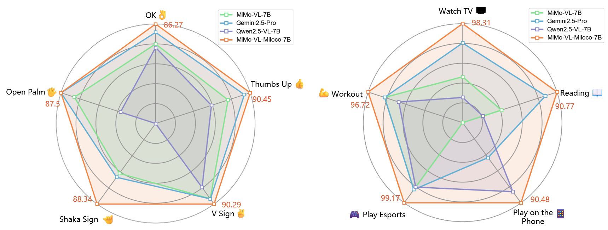
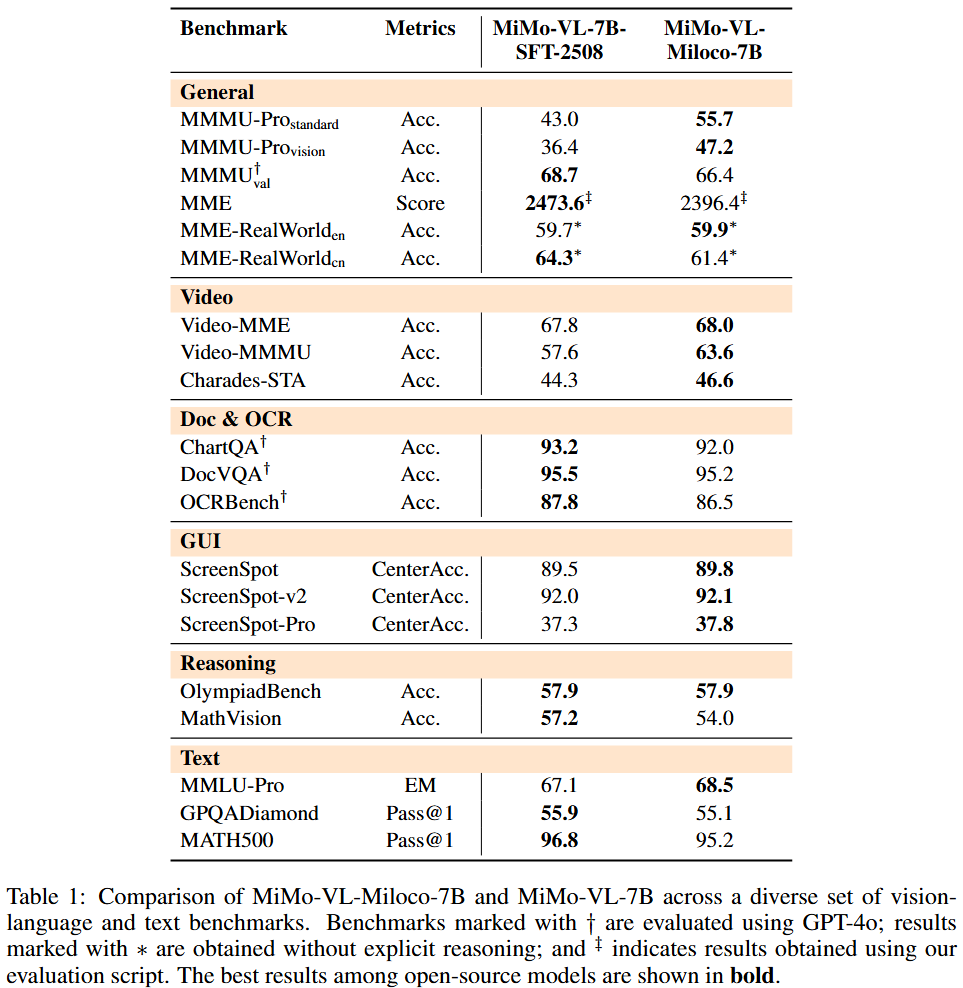
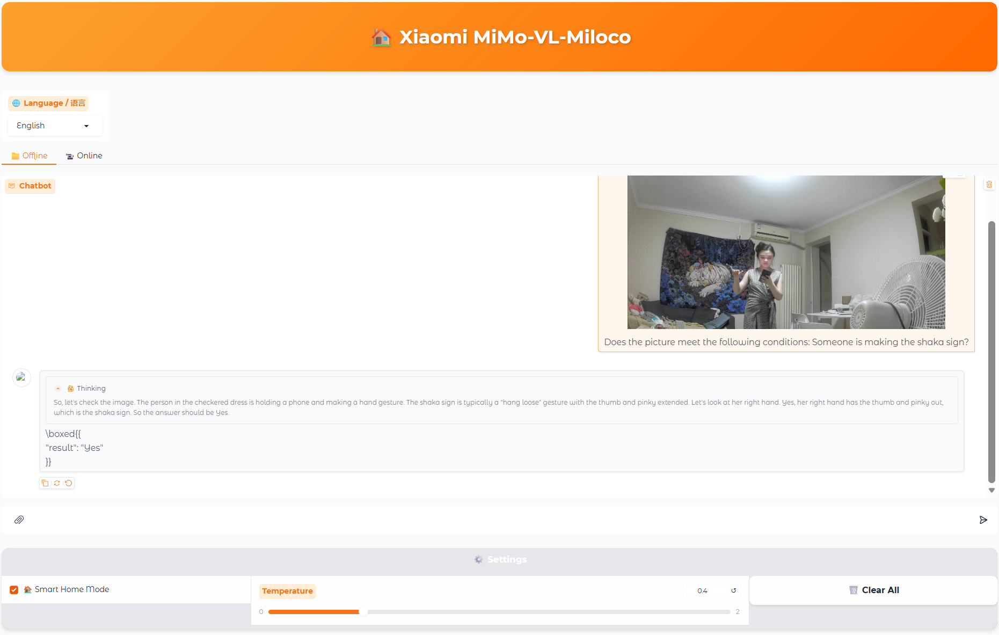

<div align="center">
  <picture>
    <source srcset="https://github.com/XiaomiMiMo/MiMo-VL/raw/main/figures/Xiaomi_MiMo_darkmode.png?raw=true" media="(prefers-color-scheme: dark)">
    
  </picture>
</div>

<br/>

<div align="center" style="line-height: 1;">
  <a href="https://huggingface.co/xiaomi-open-source/Xiaomi-MiMo-VL-Miloco" target="_blank">🤗 HuggingFace</a>
  &nbsp;|
  <a href="https://modelscope.cn/models/williamljz" target="_blank">🤖️ ModelScope</a>
  &nbsp;|
 <a href="#gradio-demo">🔥 Gradio Demo</a>
  <br/>
</div>

<br/>


## 🔥🔥🔥 消息
* 2025.11.14: 我们开源了[**MiMo-VL-Miloco-7B**](https://huggingface.co/xiaomi-open-source/Xiaomi-MiMo-VL-Miloco) 和它的量化版本[**MiMo-VL-Miloco-7B-GGUF**](https://huggingface.co/williamljz/test2_gguf)。


## 介绍

欢迎体验MiMo-VL-Miloco-7B开源项目——首个开源的、多模态的家庭场景理解大模型！

### 🤗 核心亮点
- 基于MiMo-VL-7B：强大的视觉-语言基座，具备可靠的视频理解与指令遵循能力。
- 为家庭场景而设计：能识别日常活动（电子竞技、健身锻炼、看电视、阅读等），并识读常见的手势，如比耶、点赞、张开手掌、OK，甚至666手势。
- 通用能力保持：训练策略结合了SFT和RL，MiMo-Vl-Miloco不仅拥有出色家庭场景理解能力，而且在通用任务上依然有较强的竞争力。

### 🌟 训练笔记

我们精心设计了两阶段优化策略，在保持模型基础的通用能力的同时，大幅提升模型的家庭场景理解能力。

#### 阶段 一: 监督微调 (SFT)

我们首先关注如何提升模型在家庭场景中的理解能力。通过构建少量高质量的数据集，我们在模型高效学习与推理效率之间取得了良好的平衡。

- 构造思维链数据：我们通过构造思维链数据，让模型高效学习家庭场景知识。
- 优化推理效率：通过采用“受限预算”的推理方式训练，能促使模型在推理阶段生成简洁明了的回答。

#### 阶段 二: 强化学习 (RL)

在监督微调的基础上，我们引入基于GRPO的强化学习算法来提升模型的综合性能:

- 高效的训练数据：我们采用了Time-R1 (已经被NeurIPS 2025接受)的数据策略来构建多domain的高效训练数据。
- 通用能力保持：在进行家庭场景专项优化时，维持原有的理解与语言生成能力。

简而言之：MiMo-VL-Miloco 就像你的模范室友——既友善又目光敏锐，擅长识别家中的日常事务，同时依然能适应更广阔的世界。

### 😉 模型指南

模型权重及其量化版本均已开源：

- #### [**MiMo-VL-Miloco-7B**](https://huggingface.co/xiaomi-open-source/Xiaomi-MiMo-VL-Miloco)
  - 适合绝大多数用户深度体验。  
- #### [**MiMo-VL-Miloco-7B-GGUF**](https://huggingface.co/williamljz/test2_gguf)
  - 混合精度量化版本。适合计算资源受限的场景。

## 性能表现

### 家庭场景能力评估 (F1 Score)
<div align="center">
  <picture>
    
  </picture>
</div>

### 通用能力评估
<div align="center">
  <picture>
    
  </picture>
</div>


## 部署

### 思考模式切换

模式切换的方式我们遵循MiMo-VL系列的通用做法。用户可以通过在请求语句的末尾加入```/no_think``` 标识符以退出思考模式。

- 思考模式 (默认):
  ```bash
  "Explain the relationships between the objects in the image and infer the likely next action."
  ```
- 非思考模式:
  ``` bash
  "Transcribe the handwritten note exactly as shown. /no_think"
  ```

### Gradio部署
- 安装

```bash
pip install -r requirements.txt
```

- 部署

```bash
cd demo
CKPT_PATH="checkpoint_path" python app.py
```


### 家庭/通用模式切换
您可以在用户界面上点击“智能家居模式”从通用模式切换至家庭场景模式。
<div align="center">
  <picture>
    
  </picture>
</div>